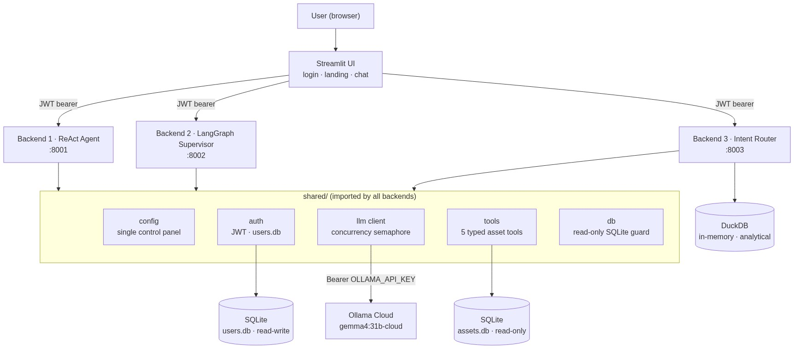
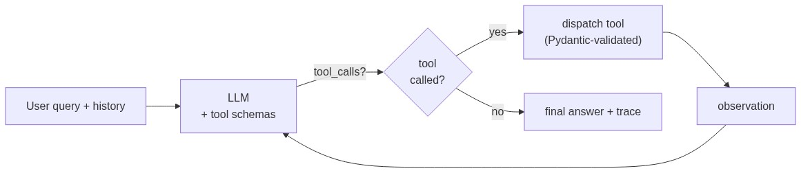
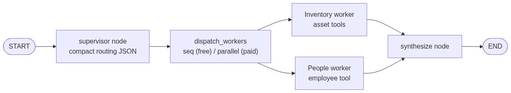
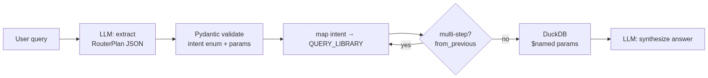
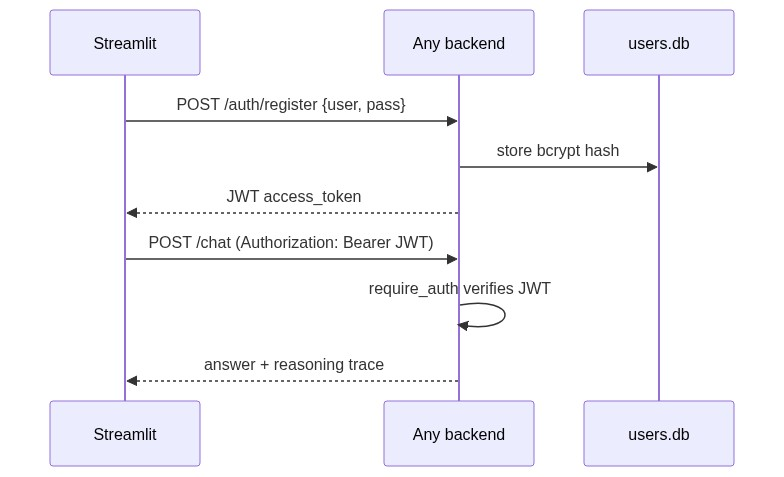

# 🗂️ AI Asset Management Assistant

An enterprise-grade, agentic AI assistant designed to process natural-language questions about IT assets (laptops, locations, assignments, device models) for XYZ Technologies.

The project features **three interchangeable backend architectures**—a **ReAct Agent**, a **LangGraph Multi-Agent Supervisor**, and an **Intent Router with DuckDB**—served behind a single **Streamlit web application** with unified **JWT authentication**, enabling side-by-side comparison of execution traces, token cost efficiency, and response latency on identical data.

Powered by **Ollama Cloud** (`gemma4:31b-cloud`) via native function calling with **zero third-party API dependencies** (no OpenAI / Gemini / Claude required).

---

## 📌 Key Highlights & Engineering Features

* 🤖 **3 Agentic Architectures Side-by-Side:** Live comparison of Hand-Rolled ReAct, LangGraph Multi-Agent Supervisor, and Deterministic DuckDB Intent Routing within a single interface.
* 🔍 **Inspectable Reasoning Traces:** Full visibility into tool selection, sub-agent dispatch assignments, step-by-step observation loops, and intent extraction plans directly in the UI.
* 🔒 **Enterprise Auth & Defense-in-Depth:** JWT (`HS256`) bearer protection, standalone `users.db` with `bcrypt` password hashing, physical SQLite `mode=ro` connection URIs, and parameterized SQL queries preventing injection by design.
* ⚡ **Concurrency Semaphore:** Process-wide `asyncio.Semaphore` ceiling matching Ollama Cloud tiers (Free=1, Pro=3, Max=10) preventing rate limits and enabling seamless parallel worker scaling.
* 🎯 **Scope Honesty:** Zero hallucination on out-of-scope queries (e.g. manager, floor)—the assistant explicitly identifies schema boundaries while fulfilling multi-step and recommendation requests against real data.

---

## 📑 Table of Contents

- [What It Does](#what-it-does)
- [High-Level Architecture](#high-level-architecture)
- [The Three Backend Architectures](#the-three-backend-architectures)
  - [1. ReAct Agent (`backend_react`)](#1--react-agent-backend_react-port-8001)
  - [2. LangGraph Supervisor (`backend_supervisor`)](#2--multi-agent-supervisor-backend_supervisor-port-8002)
  - [3. Intent Router (`backend_router`)](#3--intent-router-backend_router-port-8003)
  - [Approach Comparison Matrix](#approach-comparison-matrix)
- [Low-Level Execution Diagrams](#low-level-execution-diagrams)
- [Authentication & Security Architecture](#authentication--security-architecture)
- [Concurrency & Cloud Rate-Limiting](#concurrency--cloud-rate-limiting)
- [Data Model & Scope Honesty](#data-model--scope-honesty)
- [Folder Structure](#folder-structure)
- [Configuration Reference](#configuration-reference)
- [Setup & Running Instructions](#setup--running)
- [Testing & Verification Guide](#testing--verification-guide)

---

## What It Does

Employees ask questions in plain English and receive conversational answers backed by a structured asset database—eliminating manual spreadsheet searches. The assistant dynamically selects tools, executes multi-step lookup logic, and retains short-term conversation context for follow-up questions.

| Requirement | Example natural-language query | How it's served |
|:---|:---|:---|
| **Exact Lookup** | *"Where is AST1002?"* | Direct primary key lookup tool (`lookup_asset_by_code`) |
| **Filtered Search** | *"List all laptops in Bangalore"* | Multi-criteria search tool (`search_assets`) |
| **Multi-Step Reasoning** | *"Who else has the same laptop as Amit Kumar (AST1002)?"* | Chained employee lookup → model extraction → match search |
| **Follow-Up Context** | *"…and in Chennai?"* | Session state history preservation across turns |
| **Recommendation** | *"Find a MacBook in Bangalore"* | Category/location match tool (`recommend_assets`) |
| **Scope Honesty** | *"Who is Rahul's manager?"* | Honest boundary check: *"Manager details are not in dataset"* |

---

## High-Level Architecture



All three backends share identical configuration, authentication, LLM client, data tools, and asset data in [`shared/`](file:///d:/codes/biopharma%20assessment/shared). They differ **only in orchestration pattern**—making performance and trace comparisons completely fair and transparent in the UI.

> [!NOTE]
> All backends run as separate FastAPI services on distinct ports (`8001`, `8002`, `8003`), while the Streamlit UI connects via asynchronous HTTP requests with JWT authorization headers.

---

## The Three Backend Architectures

### 1 · ReAct Agent (`backend_react`, Port 8001)
* **Core implementation:** [`backend_react/core/agent.py`](file:///d:/codes/biopharma%20assessment/backend_react/core/agent.py)
* **Orchestration:** A single orchestrator LLM executes a hand-rolled **Reason → Act → Observe** loop built over Ollama's native tool-calling API.
* **How it works:** The model receives tool schemas and decides which function to call. The backend executes the tool, returns the observation, and loops until the model produces a final user response or hits `AGENT_MAX_STEPS` (default: 6).
* **Strengths:** Maximum flexibility for open-ended multi-step queries with full step-by-step trace visibility.

### 2 · Multi-Agent Supervisor (`backend_supervisor`, Port 8002)
* **Core implementation:** [`backend_supervisor/core/graph.py`](file:///d:/codes/biopharma%20assessment/backend_supervisor/core/graph.py)
* **Orchestration:** A **LangGraph `StateGraph`** with structured node routing.
* **How it works:** A Supervisor node classifies the query and routes it to specialized domain workers (**Inventory Worker** or **People Worker**) using minimal token context. The worker executes deterministic tools, and a final Synthesis node compiles the user answer.
* **Strengths:** High token efficiency via domain context isolation; worker tasks can run concurrently in parallel when cloud concurrency tier permits.

### 3 · Intent Router (`backend_router`, Port 8003)
* **Core implementation:** [`backend_router/core/executor.py`](file:///d:/codes/biopharma%20assessment/backend_router/core/executor.py)
* **Orchestration:** Deterministic intent extraction + **DuckDB in-memory analytical engine**.
* **How it works:** The LLM acts purely as a JSON intent & entity parser—it **never generates SQL**. Validated Pydantic intents map to pre-compiled parameterized queries in [`shared/tools/asset_tools.py`](file:///d:/codes/biopharma%20assessment/shared/tools/asset_tools.py). Chained multi-step intents resolve deterministically.
* **Strengths:** Highest security and lowest execution latency; zero risk of SQL syntax errors or invalid tool loops.

---

### Approach Comparison Matrix

| Feature / Metric | ReAct Agent (Backend 1) | Multi-Agent Supervisor (Backend 2) | Intent Router (Backend 3) |
|:---|:---|:---|:---|
| **Framework** | Hand-rolled ReAct Loop | LangGraph `StateGraph` | Hand-rolled + Pydantic + DuckDB |
| **LLM Role** | Chooses & executes tools | Routes & synthesizes | Extracts JSON intent only |
| **Database Engine** | SQLite (Read-Only) | SQLite (Read-Only) | DuckDB (In-Memory Analytical) |
| **Multi-Step Handling** | Dynamic LLM reasoning loop | Multi-worker graph state | Intent chaining (`from_previous`) |
| **SQL Generation** | None (Pre-defined tools) | None (Pre-defined tools) | None (Parameterized DuckDB queries) |
| **Token Efficiency** | Moderate (accumulates history) | High (isolated worker prompts) | Very High (short intent JSON prompt) |
| **Best Used For** | Unpredictable, open Q&A | Domain-separated multi-agent systems | Fixed query patterns, high speed & scale |

> [!TIP]
> **Free-Tier Concurrency Note:** Ollama Cloud Free tier allows 1 concurrent model request. On Free tier, Backend 2's supervisor workers run sequentially. Raising `LLM_MAX_CONCURRENCY=3` automatically enables parallel worker execution (`asyncio.gather`) with **zero code changes**.

---

## Low-Level Execution Diagrams

### Approach 1 — ReAct Loop Architecture



### Approach 2 — LangGraph Supervisor Graph



### Approach 3 — Intent Router & DuckDB Engine



---

## Authentication & Security Architecture

### Auth Flow Sequence



### Defense-in-Depth Security Principles

> [!IMPORTANT]
> Security and data isolation are enforced at the physical database layer, network transport layer, and code execution layer.

1. **Physical Read-Only SQLite Guard:**
   - The asset database is opened via SQLite URI `file:data/assets.db?mode=ro`. Write operations are physically rejected by the OS file handle.
2. **`safe_execute` Database Guard:**
   - Evaluates all query strings in [`shared/db/database.py`](file:///d:/codes/biopharma%20assessment/shared/db/database.py). Blocks non-`SELECT` statements, multi-statement stacking (`;`), and enforces `MAX_QUERY_ROWS=50`.
3. **Isolated Auth Database:**
   - User credentials live in a separate read-write SQLite database ([`data/users.db`](file:///d:/codes/biopharma%20assessment/data/users.db)) so account registration never touches the asset database.
4. **Password Security:**
   - Passwords are hashed using `bcrypt` directly in [`shared/auth/security.py`](file:///d:/codes/biopharma%20assessment/shared/auth/security.py) (avoiding deprecated passlib wrappers).
5. **JWT Token Enforcement:**
   - Endpoint protection via FastAPI dependency injection (`require_auth`). All `/chat` routes verify bearer JWT tokens signed with `HS256`.

---

## Concurrency & Cloud Rate-Limiting

Ollama Cloud limits concurrent cloud requests based on subscription tier:

$$\text{Concurrency Limit} = \begin{cases} 1 & \text{Free Tier} \\ 3 & \text{Pro Tier} \\ 10 & \text{Max Tier} \end{cases}$$

A single thread-safe `asyncio.Semaphore(LLM_MAX_CONCURRENCY)` defined in [`shared/llm/ollama_client.py`](file:///d:/codes/biopharma%20assessment/shared/llm/ollama_client.py) throttles all outgoing API requests across the entire application:

```python
# shared/llm/ollama_client.py
self._semaphore = asyncio.Semaphore(settings.llm.max_concurrency)
```

* **Free Tier (`LLM_MAX_CONCURRENCY=1`):** Requests are queued and processed sequentially, preventing HTTP 429 rate limit errors.
* **Paid Tier (`LLM_MAX_CONCURRENCY>1`):** Sub-agent calls automatically run in parallel via `asyncio.gather`.

---

## Data Model & Scope Honesty

The underlying dataset contains 21 sample IT assets across six core columns:

$$\text{Schema} = \{ \text{Asset Code}, \text{Asset Name}, \text{Category}, \text{Employee Name}, \text{Location}, \text{Purchase Date} \}$$

> [!WARNING]
> There are **no columns** for *Manager*, *Floor*, *Price*, or *Warranty Expiry*.

### Scope Honesty Guarantee
If a user requests information outside this schema (e.g. *"Who is Amit's manager?"*), the assistant does **not** hallucinate mock data. Instead, it provides an honest response:
> *"The dataset does not contain manager or floor information."*

### Requirement Mapping
- **Multi-step queries** (e.g., *"Who else has the same laptop as Amit Kumar in AST1002?"*) are answered by chaining code lookups into model matches against real database records.
- **Recommendation queries** (e.g., *"Find a MacBook in Bangalore"*) filter actual inventory by model category and location.

---

## Folder Structure

```
biopharma assessment/
├── shared/                      # Shared framework modules (imported by all backends)
│   ├── config/
│   │   └── settings.py          # Centralized Pydantic control panel (.env driven)
│   ├── auth/
│   │   ├── security.py          # Bcrypt password hashing & JWT token validation
│   │   ├── users.py             # SQLite users.db CRUD operations
│   │   └── routes.py            # FastAPI /auth/register and /auth/login endpoints
│   ├── llm/
│   │   └── ollama_client.py     # Async client with concurrency semaphore
│   ├── tools/
│   │   └── asset_tools.py       # 5 Pydantic-typed database search tools
│   └── db/
│       ├── database.py          # Read-only SQLite guard & connection pool
│       ├── schema.sql           # Database schema & indexes
│       └── init_db.py           # Seed script (CSV -> SQLite assets.db)
│
├── backend_react/               # Approach 1: ReAct Agent (Port 8001)
│   ├── core/                    # Loop logic, prompts, tool binding
│   ├── api/                     # FastAPI chat & health endpoints
│   └── main.py                  # Service entrypoint
│
├── backend_supervisor/          # Approach 2: LangGraph Multi-Agent Supervisor (Port 8002)
│   ├── core/                    # StateGraph, worker nodes, routing prompts
│   ├── api/                     # FastAPI chat & health endpoints
│   └── main.py                  # Service entrypoint
│
├── backend_router/              # Approach 3: Intent Router & DuckDB Engine (Port 8003)
│   ├── core/                    # Intent extractor, query library, DuckDB runner
│   ├── api/                     # FastAPI chat & health endpoints
│   └── main.py                  # Service entrypoint
│
├── streamlit_app/               # Streamlit Frontend Web App
│   ├── app.py                   # UI layout (Auth tab, Landing switcher, Chat pane)
│   └── api_client.py            # HTTP client handling JWT & backend communication
│
├── images/                      # Rendered architecture & execution diagrams (PNG)
│   ├── high_level_architecture.png
│   ├── react_loop.png
│   ├── supervisor.png
│   ├── router.png
│   └── auth_flow.png
│
├── data/                        # SQLite & seed datasets
│   ├── assets_seed.csv          # Sample seed asset data (21 records)
│   ├── assets.db                # Generated read-only SQLite database
│   └── users.db                 # Generated user authentication database
│
├── requirements.txt             # Python dependency manifest
├── .env.example                 # Environment configuration template
└── README.md                    # Project documentation
```

---

## Configuration Reference

All settings are managed via [`shared/config/settings.py`](file:///d:/codes/biopharma%20assessment/shared/config/settings.py) and overridable via `.env`.

| Environment Variable | Default Value | Description |
|:---|:---|:---|
| `OLLAMA_API_KEY` | *(Required)* | Ollama Cloud authentication API key |
| `LLM_MODEL` | `gemma4:31b-cloud` | Ollama model identifier |
| `LLM_MAX_CONCURRENCY` | `1` | Max concurrent LLM calls (Free=1, Pro=3, Max=10) |
| `AGENT_MAX_STEPS` | `6` | Maximum iterations for ReAct loop |
| `DB_ENGINE` | `sqlite` | Primary database driver (`sqlite` or `duckdb`) |
| `MAX_QUERY_ROWS` | `50` | Row limit for query results |
| `JWT_SECRET` | *(Dev Secret)* | Secret key for JWT signing |
| `JWT_EXPIRY_MINUTES` | `120` | JWT token validity duration |
| `SUPERVISOR_PARALLEL_WORKERS` | `true` | Enable parallel worker execution in LangGraph |
| `ROUTER_MAX_CHAINED_INTENTS` | `3` | Maximum chained intents per turn |
| `PORT_REACT` | `8001` | Backend 1 (ReAct Agent) HTTP port |
| `PORT_SUPERVISOR` | `8002` | Backend 2 (Supervisor) HTTP port |
| `PORT_ROUTER` | `8003` | Backend 3 (Intent Router) HTTP port |

---

## Setup & Running

### 1. Environment Initialization

Requires Python 3.12+.

```bash
# Create virtual environment
uv venv venv

# Activate virtual environment
# Windows PowerShell:
.\venv\Scripts\activate
# Linux/macOS:
source venv/bin/activate

# Install dependencies
uv pip install -r requirements.txt
```

### 2. Configuration & Database Seeding

```bash
# Copy example configuration
cp .env.example .env

# Set your OLLAMA_API_KEY in .env
# OLLAMA_API_KEY=your_actual_key_here

# Seed the asset database
python -m shared.db.init_db
```

### 3. Launch Services

Run each component in a separate terminal tab:

```bash
# Terminal 1: Backend 1 (ReAct Agent)
uv run uvicorn backend_react.main:app --port 8001

# Terminal 2: Backend 2 (Multi-Agent Supervisor)
uv run uvicorn backend_supervisor.main:app --port 8002

# Terminal 3: Backend 3 (Intent Router)
uv run uvicorn backend_router.main:app --port 8003

# Terminal 4: Streamlit Frontend
uv run streamlit run streamlit_app/app.py
```

Open your browser to `http://localhost:8501`.

---

## Testing & Verification Guide

### Recommended Test Matrix

Switch between approaches in the Streamlit left sidebar to evaluate responses across backends:

| Test Scenario | Sample Prompt | Expected Trace & Behavior |
|:---|:---|:---|
| **Direct Lookup** | *"Where is AST1002?"* | ReAct calls `lookup_asset_by_code`. Router executes exact PK match. |
| **Search Query** | *"List all laptops in Bangalore"* | Filters `Category=Laptop` and `Location=Bangalore`. Returns list view. |
| **Multi-Step Logic** | *"Who else has the same laptop as Amit Kumar in AST1002?"* | Resolves AST1002 to model `ThinkPad X1`, queries all holders of `ThinkPad X1`. |
| **Recommendation** | *"Find a MacBook in Bangalore"* | Filters category `MacBook` in `Bangalore`. |
| **Out-of-Scope Test** | *"Who is Rahul's manager?"* | Explicitly returns scope warning: Manager is not in database schema. |

> [!TIP]
> Click **🔍 Reasoning trace** below any assistant response in the Streamlit UI to inspect real-time tool arguments, multi-agent worker dispatches, or DuckDB intent plans.

---

## 🛠 Tech Stack

* **Language:** Python 3.12
* **LLM Engine:** Ollama Cloud (`gemma4:31b-cloud`) via Async Client
* **Web Frameworks:** FastAPI (Backends), Streamlit (Frontend)
* **Agentic Framework:** LangGraph (`StateGraph`), Hand-rolled ReAct Loop
* **Database Drivers:** SQLite3 (`mode=ro`), DuckDB (In-Memory)
* **Validation & Config:** Pydantic v2, Pydantic-Settings
* **Authentication:** PyJWT, Bcrypt
